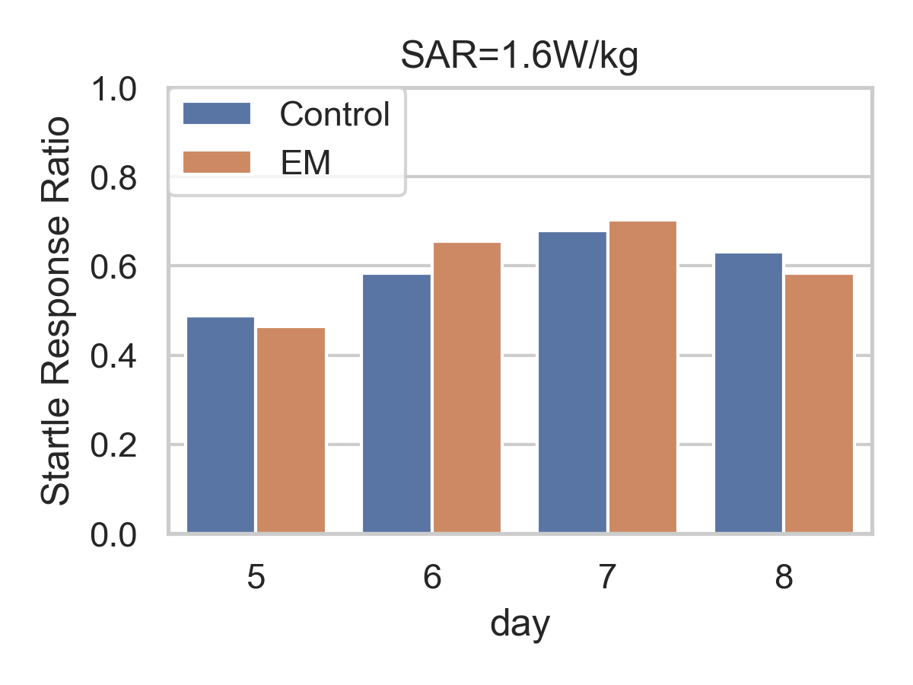
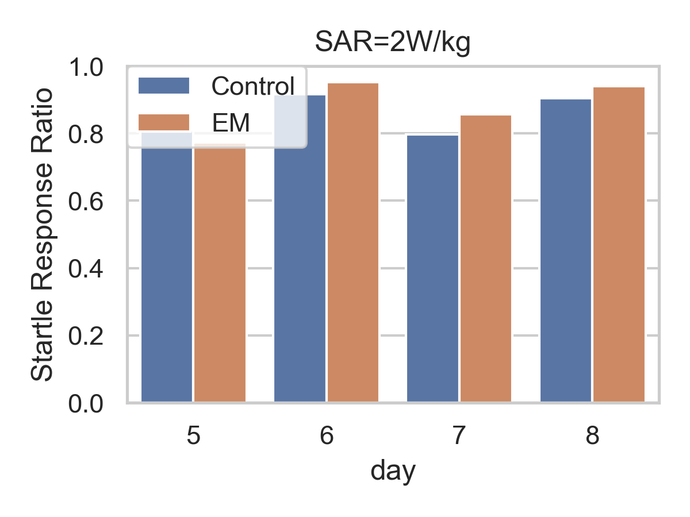

## Progress Report on the Project

#### 1. Startle response for zebrafish larvae in response to a sudden light ON
|  |  |
|:-------------------------------------------------------------------------------------------:|:---------------------------------------------------------------------------------------------:|
|          *Figure 1. 1W - Startle response ratio after sudden light ON (within 3s)*          |          *Figure 3. 1.2W - Startle response ratio after sudden light ON (within 3s)*          |

#### 2. Response to a sudden light OFF

#### 3. Adaptation after light ON (Rest Bout counts and Rest Bout mean duration)
|  |  |
|:-----------------------------------------------------------------------------------------------:|:-------------------------------------------------------------------------------------------------:|
|               *Figure 5. 1W - Adaptation time after sudden light ON (within 3s)*                |            *Figure 3. 1.2W - Adaptation time ratio after sudden light ON (within 3s)*             |

|  |  |
|:-------------------------------------------------------------------------------------------------:|:---------------------------------------------------------------------------------------------------:|
|               *Figure 5. 1W - Active bout count after sudden light ON (within 3s)*                |            *Figure 3. 1.2W - Active bout count ratio after sudden light ON (within 3s)*             |

|  |  |
|:---------------------------------------------------------------------------------------------:|:-----------------------------------------------------------------------------------------------:|
|         *Figure 5. 1W - Active bout mean duration after sudden light ON (within 3s)*          |         *Figure 3. 1.2W - Active bout mean duration after sudden light ON (within 3s)*          |

#### 4. Adaptation after light OFF (Rest Bout counts and Rest Bout mean duration)
|  |  |
|:-----------------------------------------------------------------------------------------:|:-------------------------------------------------------------------------------------------:|
|              *Figure 5. 1W - Adaptation after sudden light OFF (within 3s)*               |              *Figure 3. 1.2W - Adaptation after sudden light OFF (within 3s)*               |

|  |  |
|:-----------------------------------------------------------------------------------------------:|:-------------------------------------------------------------------------------------------------:|
|               *Figure 5. 1W - Rest Bout Count after sudden light OFF (within 3s)*               |                  *Figure 3. 1.2W - Rest Bout after sudden light OFF (within 3s)*                  |

|  |  |
|:-----------------------------------------------------------------------------------------------:|:-------------------------------------------------------------------------------------------------:|
|           *Figure 5. 1W - Rest Bout mean duration after sudden light OFF (within 3s)*           |           *Figure 3. 1.2W - Rest Bout mean duration after sudden light OFF (within 3s)*           |
