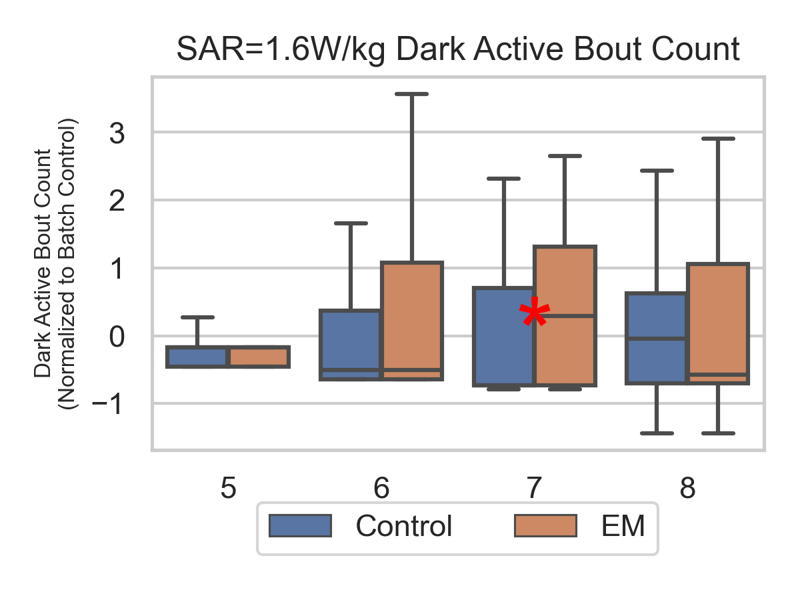

# Progress Report on the Zebrafish Project - Behaviour Analysis

## 1. Behaviour Protocol 
 OFF (habituation 30min) -> ON (30min) -> OFF (30min) -> ON (30min) -> OFF (30min)

OFF -> ON
* startle response (within 3s after light onset) - latency and ratio
* adaptation time (time to return to baseline activity after light onset)
* active bout count (number of active bouts after light onset)
* active bout mean duration (mean duration of active bouts after light onset)
* rest bout count (number of rest bouts after light onset)
* rest bout mean duration (mean duration of rest bouts after light onset)

ON -> OFF
* adaptation time (time to return to baseline activity after light offset)
* active bout count (number of active bouts after light offset)
* active bout mean duration (mean duration of active bouts after light offset)
* rest bout count (number of rest bouts after light offset)
* rest bout mean duration (mean duration of rest bouts after light offset)

## 2. Behaviour Analysis
### 2.1. Overall behaviour pattern for low and high levels of EM radiation
|      |     |     |     |
|:---------------------------------------------------------------:|:--------------------------------------------------------------:|:--------------------------------------------------------------:|:--------------------------------------------------------------:|
|    |   |   |   |

## OFF -> ON
### 2.2. Percentage of zebrafish that show a startle response after a sudden light ON

|    |    |
|:-----------------------------------------------------------------------------------------------------------------------:|:-----------------------------------------------------------------------------------------------------------------------:|
|  |  |

 * Conclusion (1) : Response to sudden light ON is not affected by EM radiation

### 2.3. Adaptation time after light ON
|  |  |
|:--------------------------------------------------------------------------------------------------------------------------------:|:----------------------------------------------------------------------------------------------------------------------------------:|
 * Conclusion (2) : 
 * After startle response, the high level EM group (SAR=2W/kg) adapts slower on 5dpf and faster on 6dpf than the control group.
 * Low EM radiation (SAR=1.6W/kg) has a faster adaptation time than control on 6dpf. 
 * Similar adaptation time between control and EM radiation on 7dpf and 8dpf.

### 2.4. Active Bout counts, Active Bout mean duration, Rest Bout counts, and Rest Bout mean duration after light ON
|    |    |    |    |
|:-------------------------------------------------------------------------------------------------------------------------------:|:-----------------------------------------------------------------------------------------------------------------------------------:|:-----------------------------------------------------------------------------------------------------------------------------:|:---------------------------------------------------------------------------------------------------------------------------------:|
|  |  |  |  |
* Conclusion (3) : 
1. Both low and high EM radiation groups have a higher active bout count than the control group on 6dpf and 7dpf.
2. Both low and high EM radiation groups have a smaller active bout mean duration than the control group on 6dpf.
3. Higher active bout count and smaller active bout mean duration indicates that the fish may have
   1) increased arousal or alertness, the zebrafish may be more alert or responsive to its environment, 
   leading to more frequent but shorter active bouts; 
   2) experienced stress or anxiety;

4. Both low and high EM radiation groups have a lower rest bout count than the control group on 6dpf.
5. Both low and high EM radiation groups have a smaller rest bout mean duration than the control group on 6dpf.
6. Lower rest bout count and smaller rest bout mean duration indicates that the fish may have
   1) increased arousal or alertness, the zebrafish may be more alert or responsive to its environment, 
   leading to fewer and shorter rest bouts;
   2) experienced stress or anxiety; fish may be unable to relax or find a sense of safety in its environment.

7. Differences between low and high EM radiation groups are gradually reduced on 7dpf, and almost disappeared on 8dpf. 
8. Higher rest bout count and lower rest bout mean duration were found in the high EM radiation group on 5 dpf,
  but the active bout count and active bout mean duration were not significantly different from the control group. 
  Frequent rest bout and shorter rest bout duration may also indicate increased vigilance or alertness.

## ON -> OFF
### 2.6 Adaptation time after light off
|  |  |
|:-------------------------------------------------------------------------------------------------------------------------------:|:---------------------------------------------------------------------------------------------------------------------------------:|

* Conclusion (4) : Adaptation time after light off is not affected by EM radiation

### 2.4. Active Bout counts, Active Bout mean duration, Rest Bout counts, and Rest Bout mean duration after light off
|    |    |    |    |
|:------------------------------------------------------------------------------------------------------------------------------:|:----------------------------------------------------------------------------------------------------------------------------------:|:----------------------------------------------------------------------------------------------------------------------------:|:--------------------------------------------------------------------------------------------------------------------------------:|
|  |  |  |  |

* Conclusion (5) : 
1. For high level EM radiation, active bout count, active bout mean duration, rest bout count,   
and rest bout mean duration are not affected by EM radiation. 
2. However, the low level EM radiation group has a higher active bout count and a smaller active bout mean duration  
on 7 dpf; and a lower rest bout count on 5 dpf; and a smaller rest bout mean duration on 5 dpf and 7 dpf.
3. The changes of active/rest bout and active/rest bout mean duration are not significant on 8 dpf for both low    and high EM radiation groups.

### Summary
* Conclusion (1) : Response to sudden light ON is not affected by EM radiation
* Conclusion (2) : Adaptation time after light ON is not affected by EM radiation
* Conclusion (3) : Active Bout counts and Active Bout mean duration after light ON is not affected by EM radiation
* Conclusion (4) : Adaptation time after light off is not affected by EM radiation
* Conclusion (5) : Active Bout counts and Active Bout mean duration after light off is not affected by EM radiation
* Conclusion (6) : Rest Bout counts and rest Bout mean duration after light off is not affected by EM radiation

### Discussion
* Similar startle response and adaptation time after light ON means the zebrafish do not show vision impairment after 
exposure to EM radiation;
* But higher active bout counts and active bout mean duration after light ON could mean alert and higher anxiety and 
less rest bout counts and rest bout mean duration after light OFF could mean alert and higher anxiety;
* Most of the activities differences were in the 5-6 dpf, and the differences were not significant in the 7-8 dpf, 
which means the zebrafish can either adapt to the environment or recover from the exposure of EM radiation.