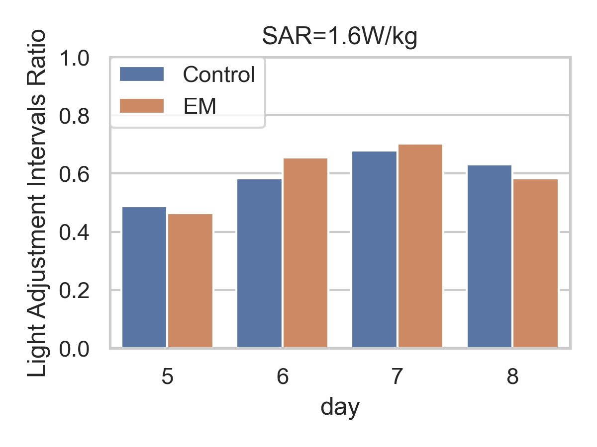
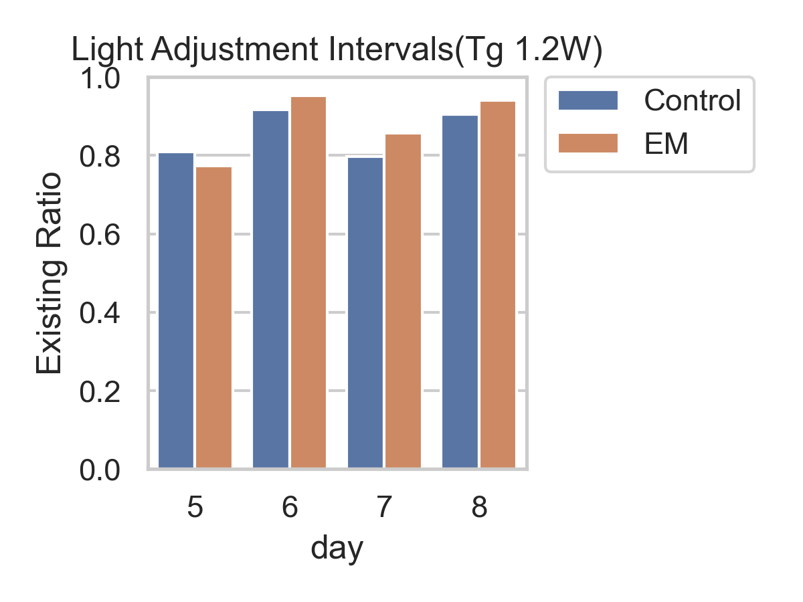
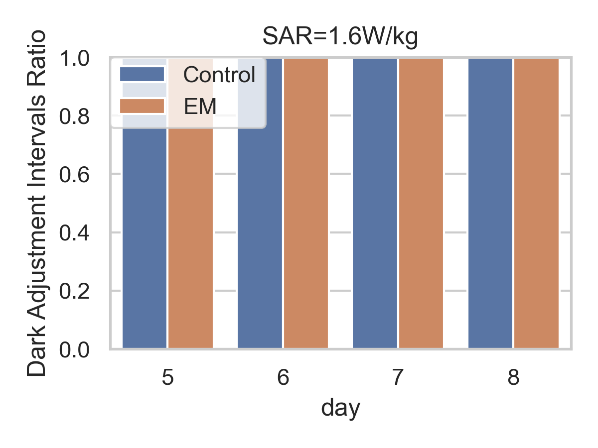
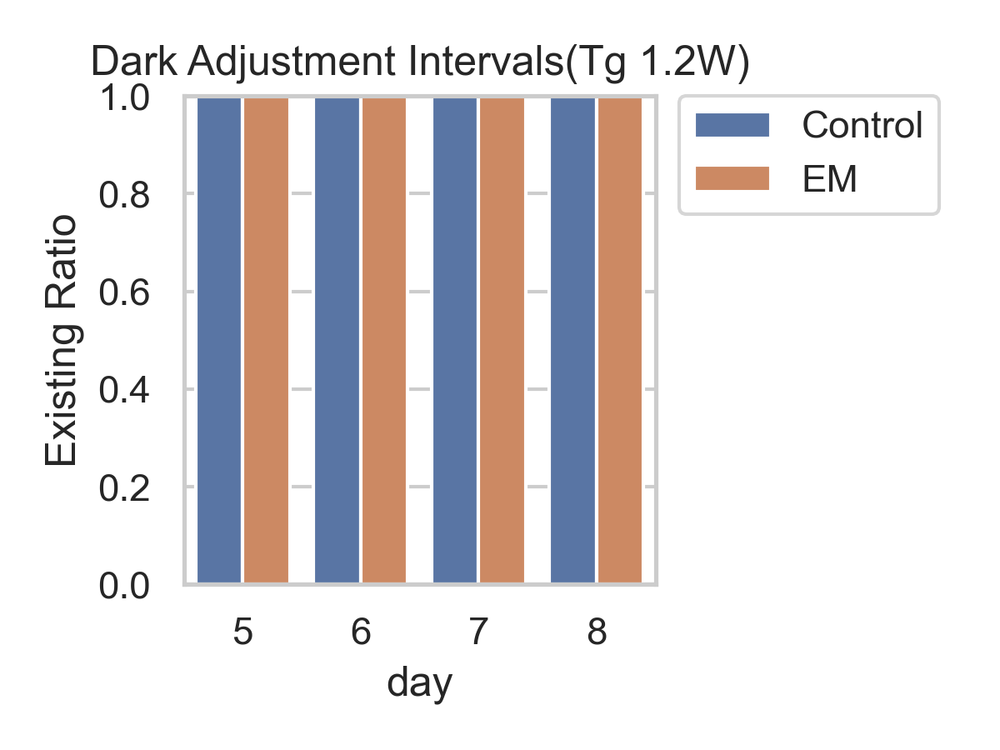
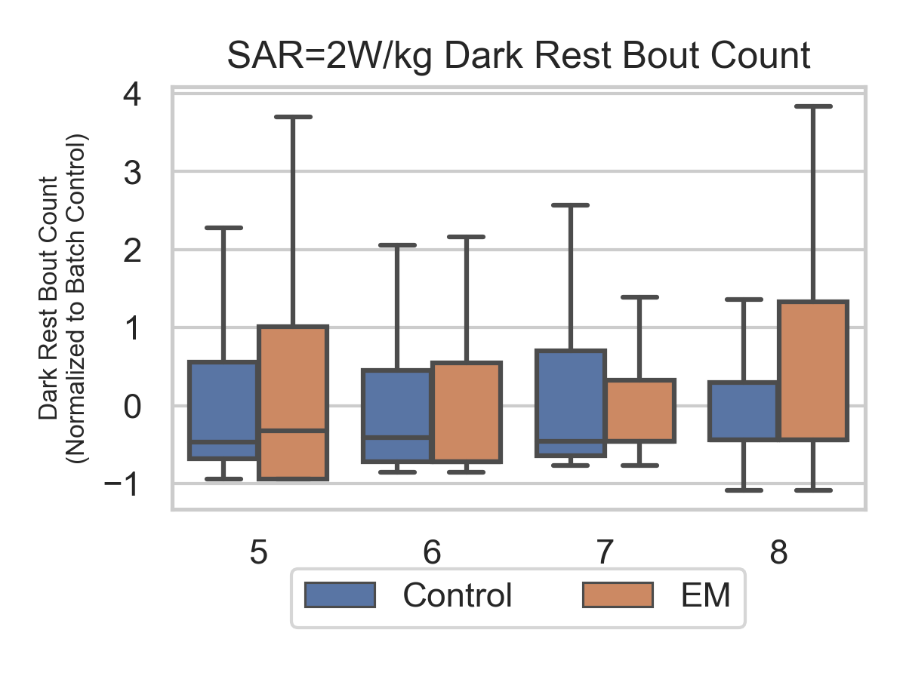

## Progress Report on the Project

#### 1. Startle response for zebrafish larvae in response to a sudden light ON
|  |  |
|:-------------------------------------------------------------------------------------------:|:---------------------------------------------------------------------------------------------:|
|          *Figure 1. 1W - Startle response ratio after sudden light ON (within 3s)*          |          *Figure 2. 1.2W - Startle response ratio after sudden light ON (within 3s)*          |

|  |  |
|:-------------------------------------------------------------------------------------------:|:---------------------------------------------------------------------------------------------:|
|          *Figure 1. 1W - Startle response ratio after sudden light ON (within 3s)*          |          *Figure 2. 1.2W - Startle response ratio after sudden light ON (within 3s)*          |

#### 2.5. Adaptation Time after light ON
|  |  |
|:------------------------------------------------------------------------------------------------------:|:--------------------------------------------------------------------------------------------------------:|
|                   *Figure 7. 1W - Adaptation time after sudden light ON (within 3s)*                   |                *Figure 8. 1.2W - Adaptation time ratio after sudden light ON (within 3s)*                |

|  |  |
|:------------------------------------------------------------------------------------------------------:|:--------------------------------------------------------------------------------------------------------:|
|                   *Figure 7. 1W - Adaptation time after sudden light ON (within 3s)*                   |                *Figure 8. 1.2W - Adaptation time ratio after sudden light ON (within 3s)*                |

#### 2.2 Adaptation after light ON (Active Bout counts and Active Bout mean duration)
|  |  |
|:-------------------------------------------------------------------------------------------------------:|:---------------------------------------------------------------------------------------------------------:|
|                   *Figure 3. 1W - Adaptation time after sudden light ON (within 3s)*                    |                *Figure 4. 1.2W - Adaptation time ratio after sudden light ON (within 3s)*                 |

#### 2.1 Adaptation after light ON (Active Bout counts and Active Bout mean duration)
|  |  |
|:---------------------------------------------------------------------------------------------------:|:-----------------------------------------------------------------------------------------------------:|
|                    *Figure 3. 1W - Bout event after sudden light ON (within 3s)*                    |                    *Figure 4. 1.2W - Bout event after sudden light ON (within 3s)*                    |

#### 2.4 Adaptation after light ON (Rest Bout counts and Rest Bout mean duration)
|  |  |
|:-----------------------------------------------------------------------------------------------------:|:-------------------------------------------------------------------------------------------------------:|
|                  *Figure 5. 1W - Adaptation time after sudden light ON (within 3s)*                   |               *Figure 6. 1.2W - Adaptation time ratio after sudden light ON (within 3s)*                |

#### 2.1 Adaptation after light ON (Active Bout counts and Active Bout mean duration)
|  |  |
|:-------------------------------------------------------------------------------------------------:|:---------------------------------------------------------------------------------------------------:|
|                   *Figure 3. 1W - Bout event after sudden light ON (within 3s)*                   |                   *Figure 4. 1.2W - Bout event after sudden light ON (within 3s)*                   |

|  |  |
|:-----------------------------------------------------------------------------------------------------:|:-------------------------------------------------------------------------------------------------------:|
|                 *Figure 5. 1W - Active bout count after sudden light ON (within 3s)*                  |              *Figure 3. 1.2W - Active bout count ratio after sudden light ON (within 3s)*               |

|  |  |
|:-----------------------------------------------------------------------------------------------------:|:--------------------------------------------------------------------------------------------------:|
|                 *Figure 5. 1W - Active bout count after sudden light ON (within 3s)*                  |            *Figure 3. 1.2W - Active bout count ratio after sudden light ON (within 3s)*            |

|  |  |
|:----------------------------------------------------------------------------------------------------:|:------------------------------------------------------------------------------------------------------:|
|                 *Figure 5. 1W - Rest Bout Count after sudden light OFF (within 3s)*                  |                    *Figure 3. 1.2W - Rest Bout after sudden light OFF (within 3s)*                     |

#### 3. Adaptation after light OFF (Rest Bout counts and Rest Bout mean duration)
|  |  |
|:------------------------------------------------------------------------------------------------:|:--------------------------------------------------------------------------------------------------:|
|                  *Figure 5. 1W - Adaptation after sudden light OFF (within 3s)*                  |                  *Figure 3. 1.2W - Adaptation after sudden light OFF (within 3s)*                  |

|  |  |
|:------------------------------------------------------------------------------------------------------:|:--------------------------------------------------------------------------------------------------------:|
|              *Figure 5. 1W - Rest Bout mean duration after sudden light OFF (within 3s)*               |              *Figure 3. 1.2W - Rest Bout mean duration after sudden light OFF (within 3s)*               |

|  |  |
|:--------------------------------------------------------------------------------------------------:|:----------------------------------------------------------------------------------------------------:|
|            *Figure 5. 1W - Rest Bout mean duration after sudden light OFF (within 3s)*             |            *Figure 3. 1.2W - Rest Bout mean duration after sudden light OFF (within 3s)*             |
